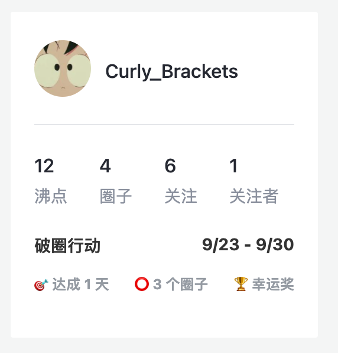
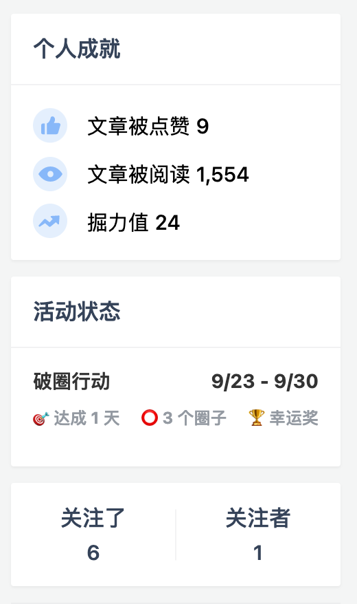

# UserScripts

一些自制的油猴脚本

## Juejin Activities Enhancer（掘金活动辅助工具）

目前已支持：

- 沸点「破圈行动」

### 沸点「破圈行动」

- 在圈子菜单中显示破解状态；
- 在沸点页和个人主页展示当前达成情况和奖项

### TODO

- [ ] 接入 Babel
- [ ] 接入 ESLint 或 TypeScript
- [ ] 支持 “程序员必懂小知识” 活动
