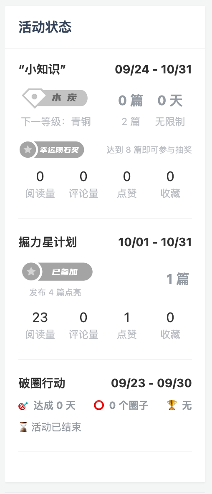
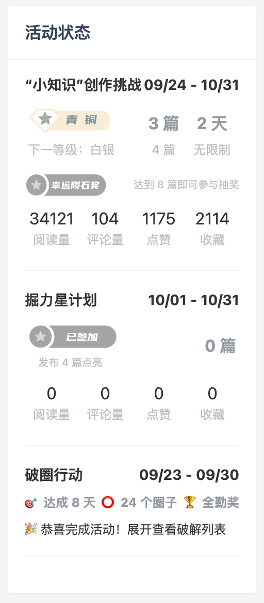
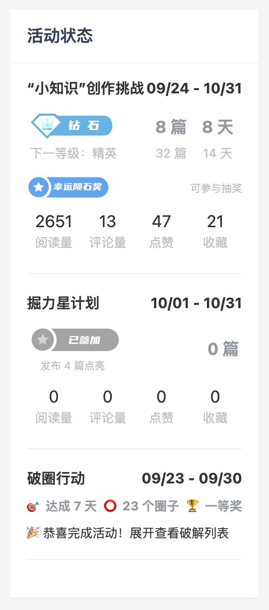
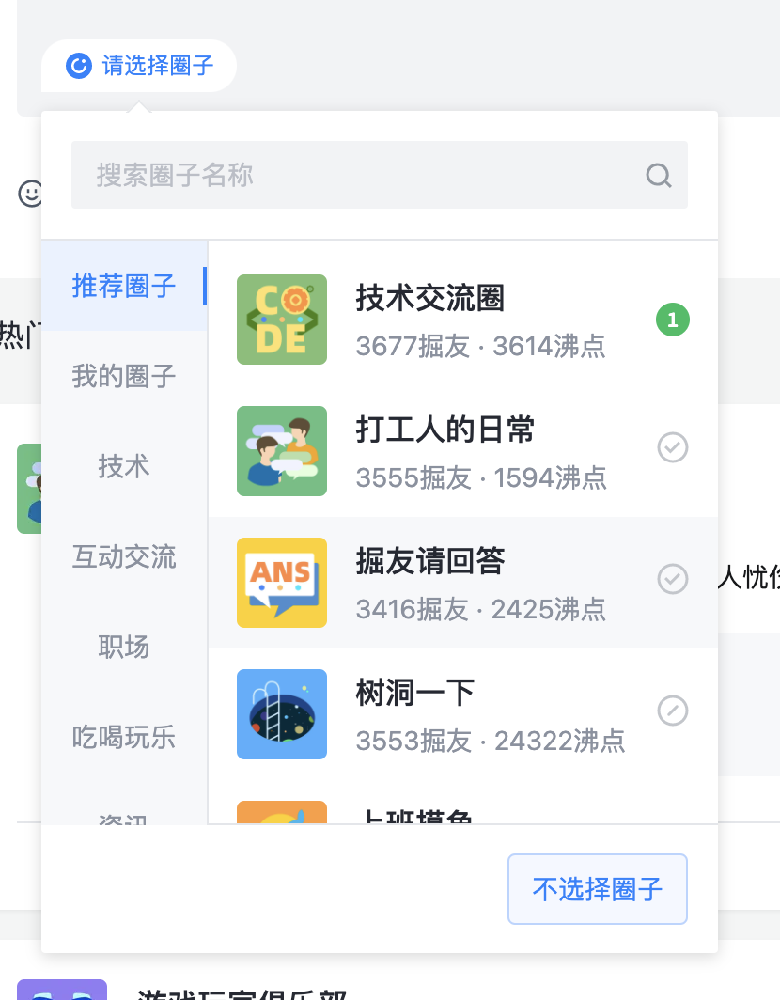
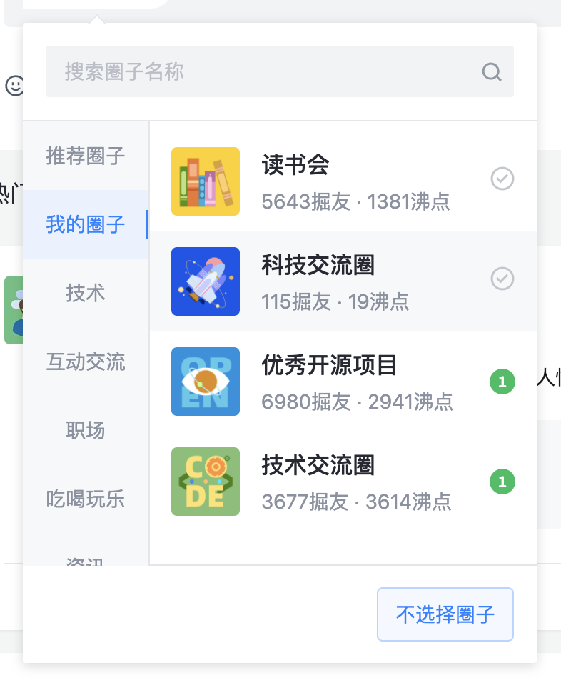
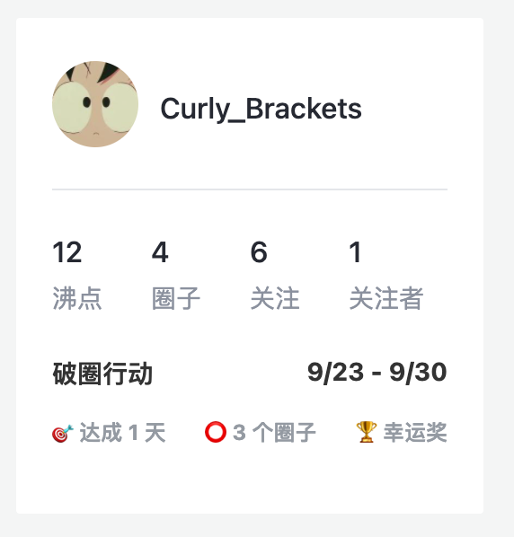
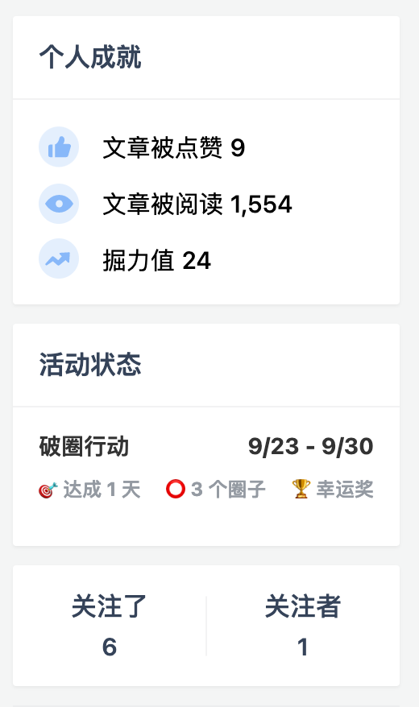

# 🧐 掘金活动小助手

掘金每个月都有一些有意思的活动，但目前缺少个人活动进度统计展示的功能，会有一些不方便。

小助手会跟进掘金上线的活动，提供进度追踪、数据统计、操作辅助等功能。

## 已支持的活动

### “程序员必懂小知识”创作挑战 + “掘力星计划”

_2021-09-24 - 2021-10-31_

- 推算当前可获奖项
- 统计阅读量、点赞、收藏、评论量

<table>
<tr>
<td></td>
<td>

</td>
<td>

</td>
</tr>
</table>

### 沸点【破圈行动】

_2021-09-23 - 2021-09-30_

- 在圈子菜单中显示破解状态；
- 在沸点页和个人主页展示当前达成情况和奖项

<table>
<tr>
<td>

</td>
<td>

</td>
</tr>
<tr>
<td>

</td>
<td>

</td>
</tr>
</table>

## 注意

由于活动具有实时性，请确保脚本开启自动更新功能。
